Most of us here are familiar with Instagram. Sometimes we're greeted with selfies. Sometimes we're greeted with foodies. I don't know about you, but I'm not terribly interested in celebrity selfies and fancy hamburgers.

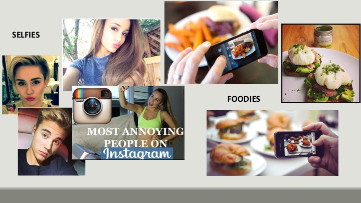

It can be hard to find relevant content on Instagram. Sure, we could search for hashtags, but that requires that we know what we're looking for before hand. And even if we did, we'd only get back images that have been tagged.

What if we could use the content of the images, instead? For example let's say you're interested in dogs. Patriotic, fourth-of-july dogs. Here's an image you might enjoy.

Or maybe you enjoy cinematic, aerial views of San Francisco. You might love this photo here.
This is the type of content-based recommendation that we're aiming to do.

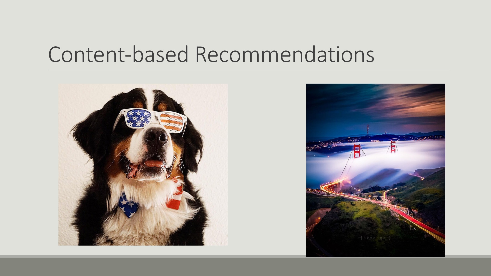

And here's the pipeline I used to do it:

* I used Selenium Webdriver for data collection.
* Data storage and management using Postgres database.
* Images were featurized by a neural network trained on Imagenet dataset.
* Used python's scikit-learn library to analyze featurized vectors.


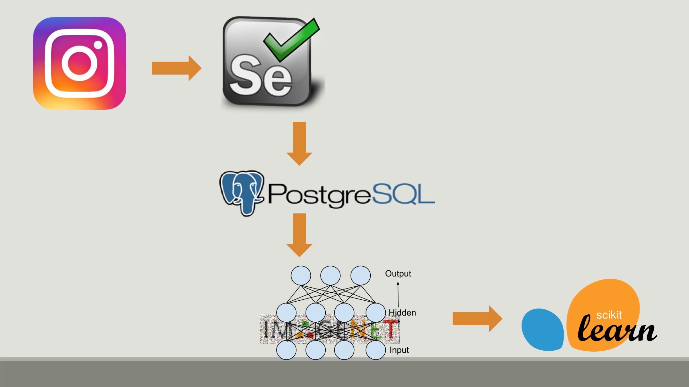

My first approach was the natural one: represent each user as an average of their images and compare users to each other via cosine similarity.

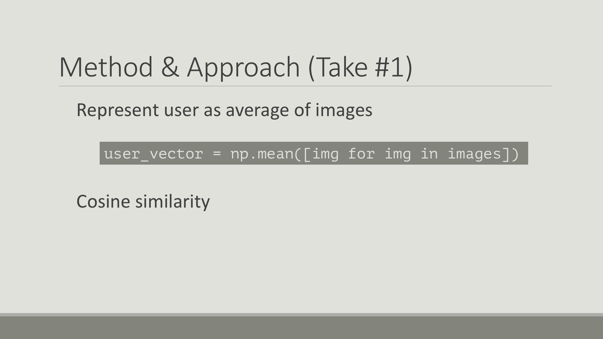

I tested this using an input of cat images, the model recommended Justin Bieber..

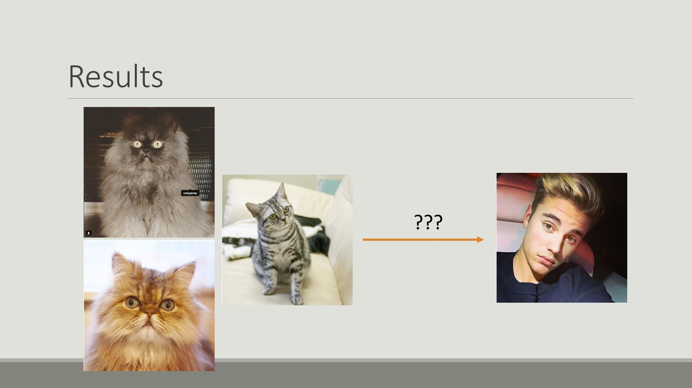
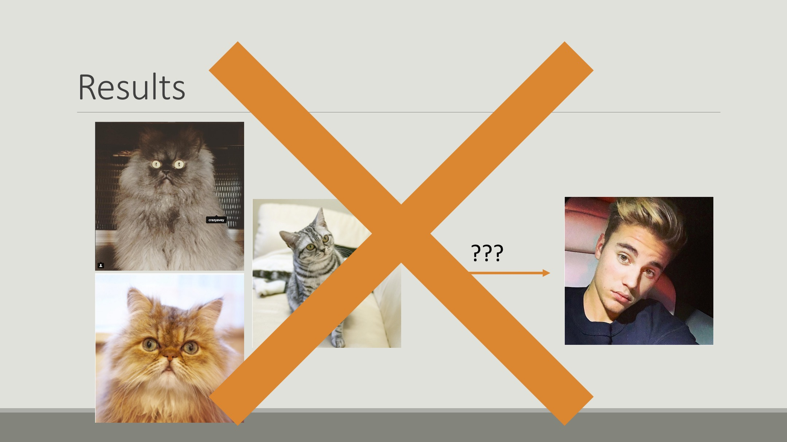

I knew that couldn't be right.. back to the drawing board..

My next approach was to use TF-IDF.
The benefit with this is that the model is additive and penalizes less significant features.

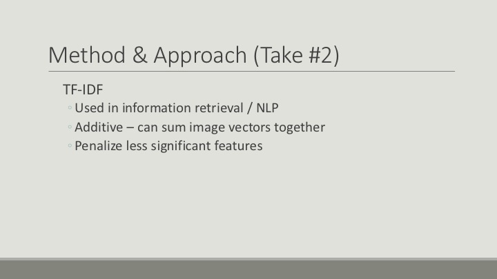

A quick primer on TF-IDF: Let's say we have these three strings of words.
```python
s1 = "the brown buffalo buffalo"
s2 = "the brown dog"
s3 = "the cat"
corpus = [s1,s2,s3]
```
The set of all strings is our corpus.
We'll call each string a document.
Each document has a word count, of course. In s3, "the" and "cat" each show up once, and everything else is zero. We'll call this a term frequency vector.

We can also look at the count of documents that contain each term to get an IDF vector. This is the money maker. Terms that show up often have a larger denominator and are valued less.


Here's the analogy:
* One document :: One images
* Term frequency vector :: Feauturized output of the neural network
* Corpus :: Collection of all images

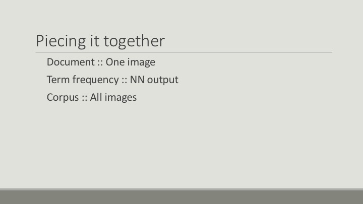

Here are some results using this method:
The output for this `cat` profile (`wa_sabi`) is one from the `cat` category (`leonliu`).

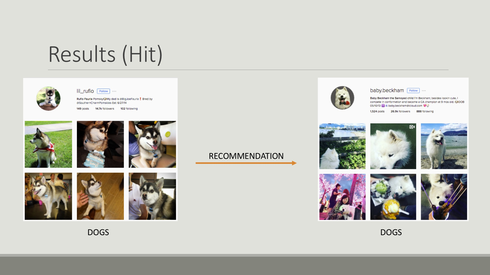

The output for this `dog` profile (`lil_rufio`) is one from the `dog` category (`baby.beckham`).

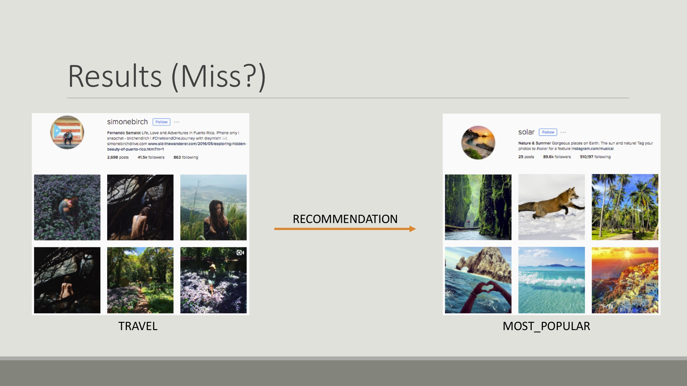
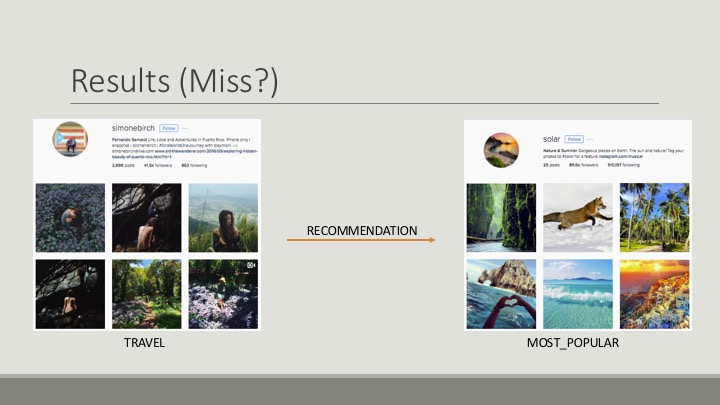

This last result I found really interesting. The input profile is from my `travel` category (`simonebirch`), but the recommended profile is from my `most_popular` category (`solar`). At first glance you might think this is a bad recommendation, but when we take a closer look we can see that both profiles include images of natural scenery. Maybe the model isn't too far off the mark.


Now that we have a baseline model with some promise, I'd like to extend the analogy between computer vision and NLP to do some topic modeling among images and users. I'd also like to vary the posting habits of users, because most people don't post images of just one thing. Eventually, I'd like to be able to cluster users together by their posting habits and compare users that way. That would be so interesting!


