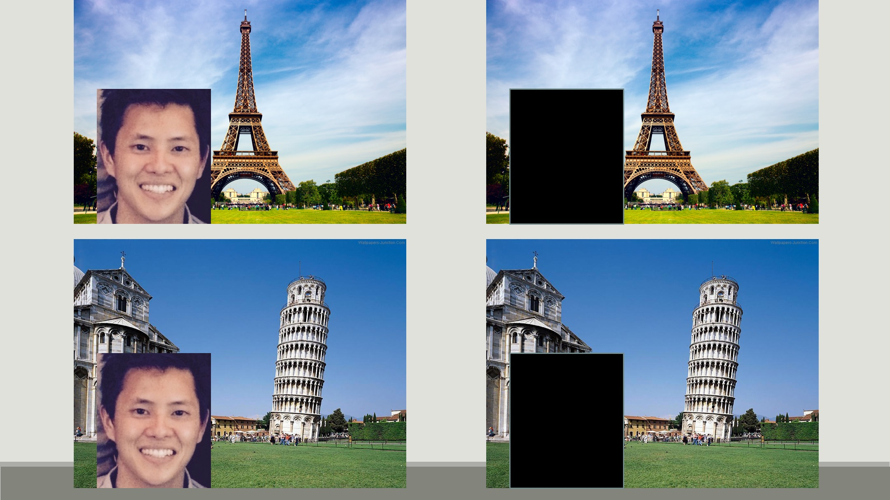

Most of us here are familiar with Instagram. Sometimes we're greeted with selfies. Sometimes we're greeted with foodies. I don't know about you, but I'm not terribly interested in celebrity selfies or fancy hamburgers.

It can be hard to find relevant content on Instagram. Sure, we could search for `#hashtags`, but that requires that we know what we're looking for before hand. And even if we did, we'd only get back images that have been tagged.

What if we could use information in the photos instead? For example let's say you're interested in dogs. Patriotic, fourth-of-july dogs. Here's something you might enjoy.

Or maybe you enjoy cinematic, aerial views of San Francisco. This would be perfect for you.
This is the type of content-based recommendation that I'm aiming to do.

And here's the pipeline I used to do it:

* Selenium Webdriver for data collection
* Postgres database for storage and management
* Neural network (pre-trained on Imagenet dataset) for image featurization
* Python's scikit-learn library for analysis

My first approach was the natural one: represent each user as an average of their images and compare users to each other via cosine similarity.

Throughout my testing and exploration,  I noticed that the top results were consistently coming from my `most_popular` category. When I tested this using an input of cat images, the model recommended Justin Bieber..

I knew that couldn't be right, as much as I wanted it to be. Boy did I want it to be right. Little known fact, several instructors warned me of the trials and tribulations that come with using a neural network. I was stubborn and let myself be enticed by the allure of those mysterious hidden layers. (What are they hiding from, anyway?) So it was back to the drawing board for me.. I had already dumped weeks into the project; it was too late to abandon and change projects now.

I took a break to clear my mind with some coffee. Actually, there were several coffee breaks. And then it dawned on me. Have you ever spit out coffee from your mouth because of an epiphany? I haven't, but I've always thought that would be a fun story to tell.

Maybe what's happening is that by averaging images together, we're aggregating all that noise and drowning out any signal that might be there.

Take a look at some of the candidates from my `most_popular` category: `zooeydeschanel`, `kimkardashian`, `onedirection`. I'll call your attention to this middle one (`kimkardashian`). What is going on there? Random mosaics of baby North's head? Or is that baby Saint West? I don't know which child has which name. That's besides the point; my hypothesis is that celebrities have unpredictable, noisy posting behavior, which is what we get when we average a typical user's images together.

What can we do to eliminate these noisy features?

Enter TFIDF.
The benefit with this is that the model is additive and penalizes less significant features.
Say we were looking at photos of my trip through Europe, and I took a butt-ton of selfies. We could just ignore the big ol' head in the photo (but why would you want to? :sunglasses:) and choose to focus on the background because that's actually changing from one photo to the next. And that's why TFIDF is the money maker.

Here are some results using this method:
The output for this `cat` profile (`wa_sabi`) is one from the `cat` category (`leonliu`).

The output for this `dog` profile (`lil_rufio`) is one from the `dog` category (`baby.beckham`).

This last result I found really interesting. The input profile is from my `travel` category (`simonebirch`), but the recommended profile is from my `most_popular` category (`solar`). At first glance we should be tempted to call this a bad recommendation, but a closer look shows that both profiles include images of natural scenery. Maybe the model isn't too far off the mark.

Now that we have a baseline model with some promise, I'd like to extend the analogy between computer vision and NLP to do some topic modeling among images and users. It would also be worthwhile to vary the posting habits of users, because most people don't post images of just one thing. Eventually, I'd like to be able to cluster users together by their posting habits and compare users that way. Wouldn't that be interesting?!

