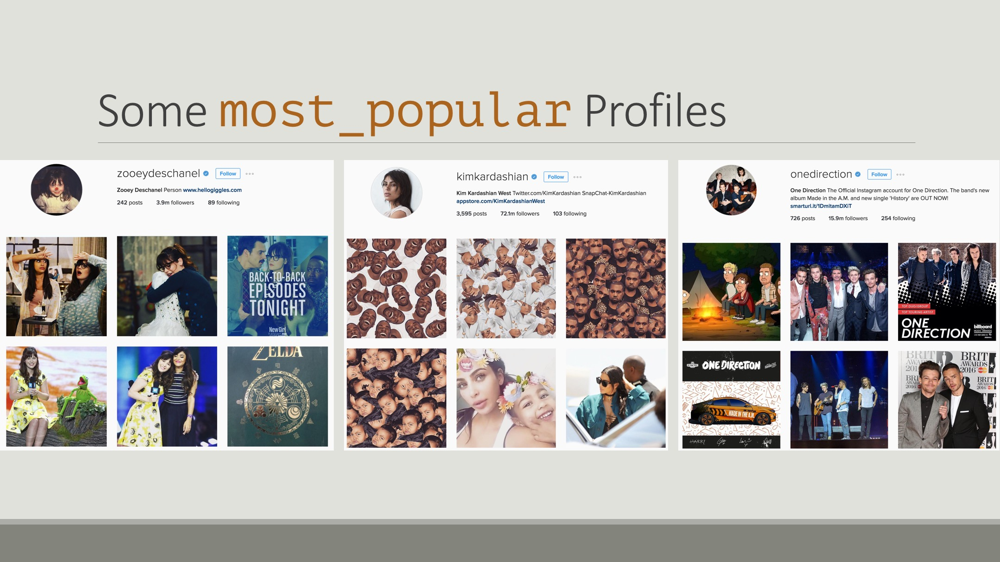
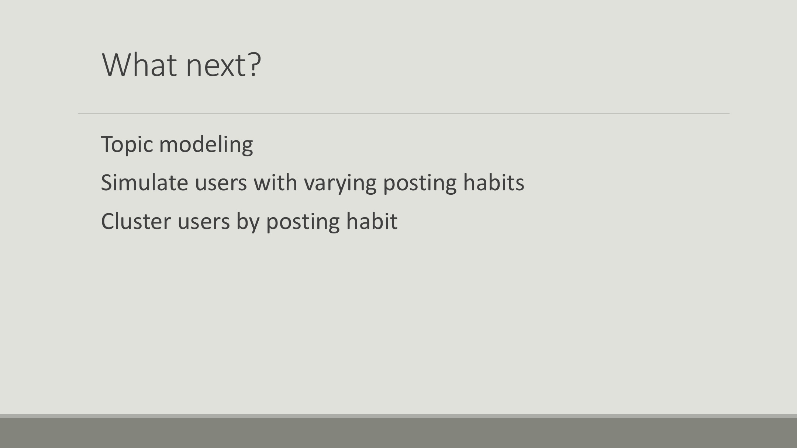

Most of us here are familiar with Instagram. Sometimes we're greeted with selfies. Sometimes we're greeted with foodies. I don't know about you, but I'm not terribly interested in celebrity selfies and fancy hamburgers.


It can be hard to find relevant content on Instagram. Sure, we could search for `#hashtags`, but that requires that we know what we're looking for before hand. And even if we did, we'd only get back images that have been tagged.

What if we could use information in the photos instead? For example let's say you're interested in dogs. Patriotic, fourth-of-july dogs. Here's an something you might enjoy.

Or maybe you enjoy cinematic, aerial views of San Francisco. This would be perfect for you.
This is the type of content-based recommendation that I'm aiming to do.


And here's the pipeline I used to do it:

* Selenium Webdriver for data collection
* Postgres database for storage and management
* Neural network (pre-trained on Imagenet dataset) for image featurization
* Python's scikit-learn library for analysis


My first approach was the natural one: represent each user as an average of their images and compare users to each other via cosine similarity.


When I tested this using an input of cat images, the model recommended Justin Bieber..


I knew that couldn't be right.. back to the drawing board..


My next approach was to use TF-IDF.
The benefit with this is that the model is additive and penalizes less significant features.



A quick primer on TF-IDF: Let's say we have these three strings of words:
```python
s1 = "the brown buffalo buffalo"
s2 = "the brown dog"
s3 = "the cat"
corpus = [s1,s2,s3]
```
The set of all strings is our corpus.
We'll call each string a document.
Each document has a word count, of course. In s3, "the" and "cat" each show up once, and everything else is zero: `[0 0 1 0 1]`. We'll call this the term frequency vector.

We can also look at the count of documents that contain each term to get an IDF vector. This is the money maker!! Terms that show up often have a larger denominator, so they contribute less to the model.


Here's the analogy:
* One document :: One images
* Term frequency vector :: Feauturized output of the neural network
* Corpus :: Collection of all images


Here are some results using this method:
The output for this `cat` profile (`wa_sabi`) is one from the `cat` category (`leonliu`).


The output for this `dog` profile (`lil_rufio`) is one from the `dog` category (`baby.beckham`).




This last result I found really interesting. The input profile is from my `travel` category (`simonebirch`), but the recommended profile is from my `most_popular` category (`solar`). At first glance we might want to call this a bad recommendation, but a closer look shows that both profiles include images of natural scenery. Maybe the model isn't too far off the mark.


Now that we have a baseline model with some promise, I'd like to extend the analogy between computer vision and NLP to do some topic modeling among images and users. It would also be worthwhile to vary the posting habits of users, because most people don't post images of just one thing. Eventually, I'd like to be able to cluster users together by their posting habits and compare users that way. Wouldn't that be interesting?!


