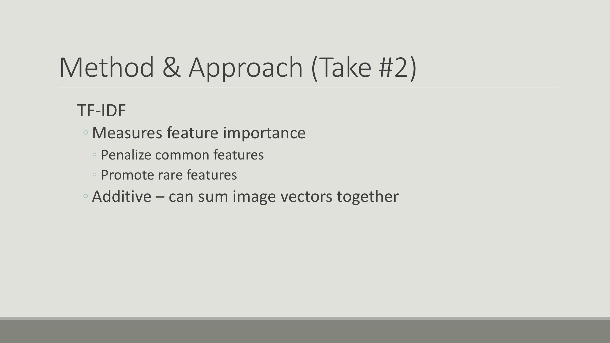

Most of us here are familiar with Instagram. Sometimes we're greeted with selfies. Sometimes we're greeted with foodies. I don't know about you, but I'm not terribly interested in celebrity selfies and fancy hamburgers.


It can be hard to find relevant content on Instagram. Sure, we could search for hashtags, but that requires that we know what we're looking for before hand. And even if we did, we'd only get back images that have been tagged.

What if we could use the content of the images, instead? For example let's say you're interested in dogs. Patriotic, fourth-of-july dogs. Here's an image you might enjoy.

Or maybe you enjoy cinematic, aerial views of San Francisco. You might love this photo here.
This is the type of content-based recommendation that we're aiming to do.


And here's the pipeline I used to do it:

* I used Selenium Webdriver for data collection.
* Data storage and management using Postgres database.
* Images were featurized by a neural network trained on Imagenet dataset.
* Used python's scikit-learn library to analyze featurized vectors.


My first approach was the natural one: represent each user as an average of their images and compare users via cosine similarity.


I tested this using an input of cat images, the model recommended Justin Bieber..


I knew that couldn't be right.. back to the drawing board..

My next approach was to use TF-IDF.
The benefit with this is that the model is additive and penalizes less significant features.


A quick primer on TF-IDF: Let's say we have these three strings of words.
```python
s1 = "the brown buffalo buffalo"
s2 = "the brown dog"
s3 = "the cat"
corpus = [s1,s2,s3]
```
The set of all strings is our corpus.
We'll call each string a document.
Each document has a word count, of course. In s3, "the" and "cat" each show up once, and everything else is zero. We'll call this a term frequency vector.

We can also look at the count of documents that contain each term to get an IDF vector. This is the money maker. Terms that show up often have a larger denominator and are valued less.




Here are some results of this method:
The output for this cat profile is that cat profile.
The output for this dog profile is that dog profile.
Here's a result that i found interesting. The input profile is from my travel category, but the recommended profile is from my most_popular category. At first glance, that seems like it would be a bad recommendation, but when we take a closer look we can see that both profiles have images of natural scenery.

I know that this model is performing well because the output for this travel profile is that most_popular profile. Even though these profiles belong to different categories, we as humans we can see similar themes among the images.


![alt text][Slide04]
![alt text][Slide06]
![alt text][Slide07]
![alt text][Slide08]
![alt text][Slide09]
![alt text][Slide10]
![alt text][Slide11]
![alt text][Slide12]
![alt text][Slide14]
![alt text][Slide15]
![alt text][Slide16]
![alt text][Slide17]
![alt text][Slide18]
![alt text][Slide19]

[Slide04]: ./slides/Slide04.jpg "Slide04"
[Slide06]: ./slides/Slide06.jpg "Slide06"
[Slide07]: ./slides/Slide07.jpg "Slide07"
[Slide08]: ./slides/Slide08.jpg "Slide08"
[Slide09]: ./slides/Slide09.jpg "Slide09"
[Slide10]: ./slides/Slide10.jpg "Slide10"
[Slide11]: ./slides/Slide11.jpg "Slide11"
[Slide12]: ./slides/Slide12.jpg "Slide12"
[Slide14]: ./slides/Slide14.jpg "Slide14"
[Slide15]: ./slides/Slide15.jpg "Slide15"
[Slide16]: ./slides/Slide16.jpg "Slide16"
[Slide17]: ./slides/Slide17.jpg "Slide17"
[Slide18]: ./slides/Slide18.jpg "Slide18"
[Slide19]: ./slides/Slide19.jpg "Slide19"
